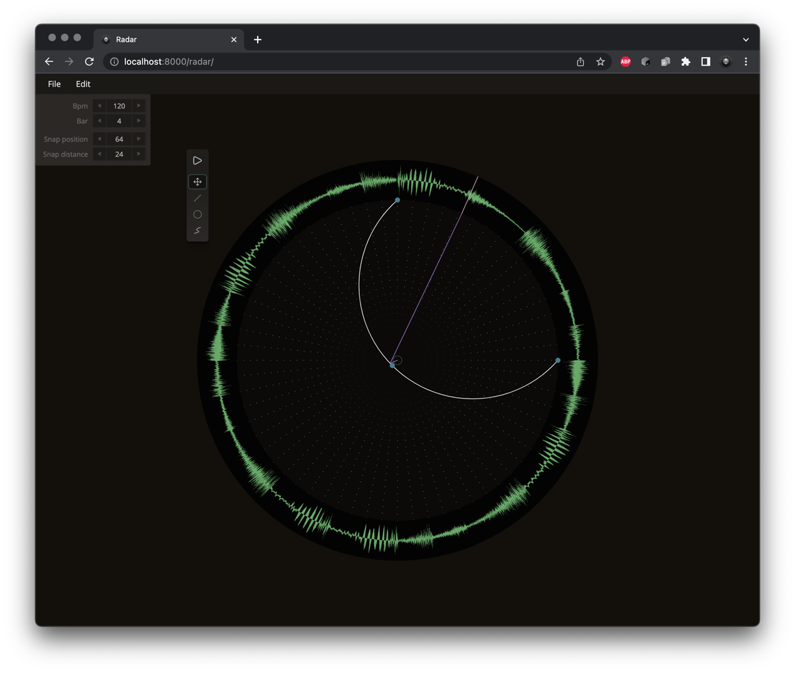

# Radar

Typescript version of an audio loop experiment presented on **Flash on the Beach** in 2009.

[Open](https://andremichelle.github.io/radar/) | **Chrome Only!**

# Build
Make sure to have sass installed and run in the console:

    sass sass/main.sass:bin/main.css --watch

Make sure to have typescript installed and run in the console:

    tsc -p ./typescript/tsconfig.json --watch

# Todo

* Time-stretching
* Selection of samples